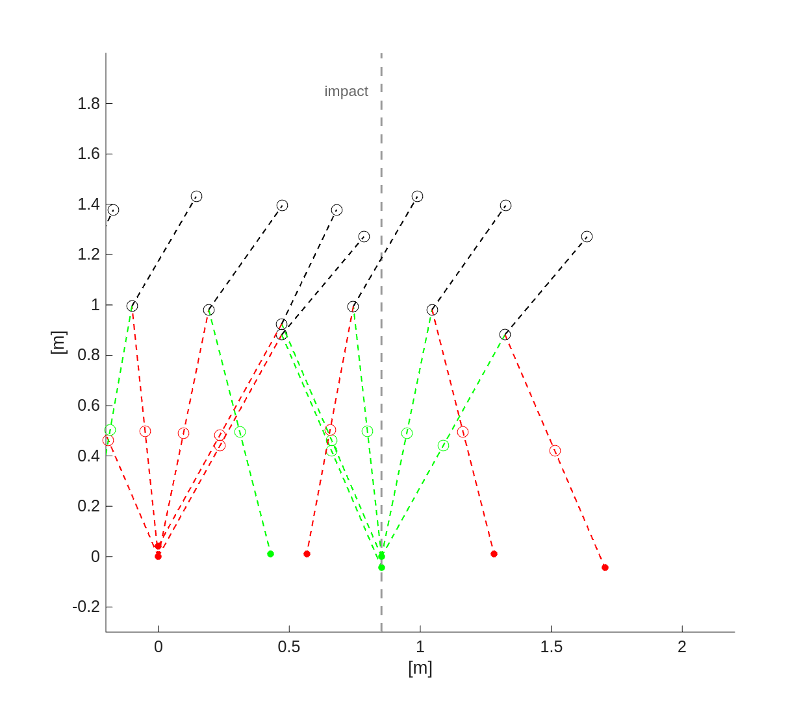
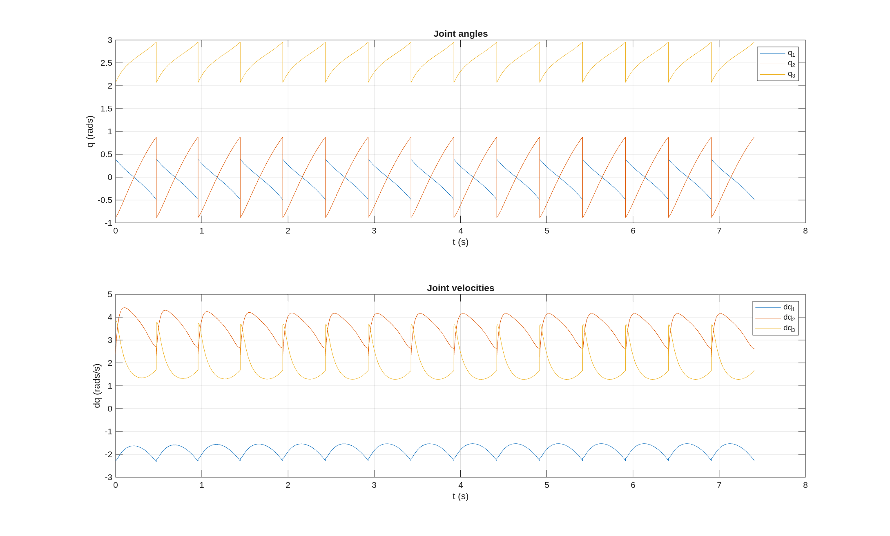
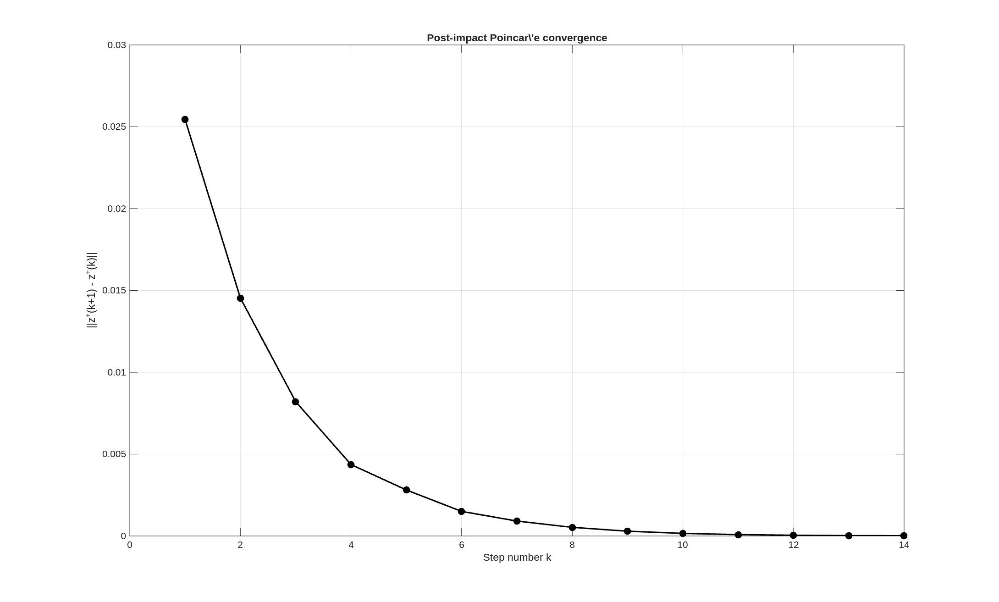
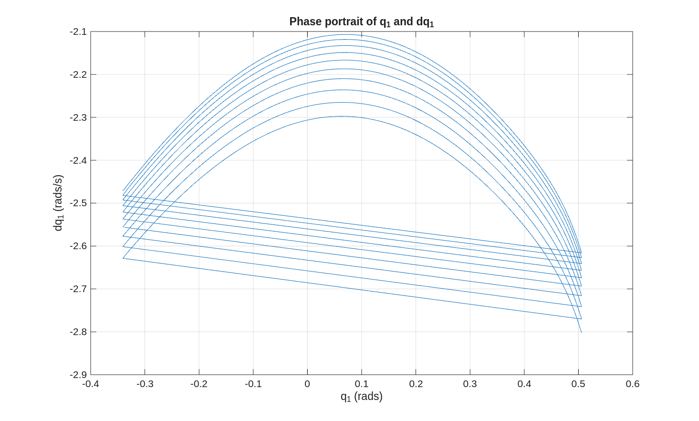

<div align="center">

# Hybrid Zero Dynamics-Based Gait Design and Feedback Linearization Control of a 3-Link Planar Bipedal Robot

**EECE7398 &middot; Legged Robotics &middot; Northeastern University**

Shriman Raghav Srinivasan &nbsp;&middot;&nbsp; Gautham Ramkumar &nbsp;&middot;&nbsp; Prasath Saravanan &nbsp;&middot;&nbsp; Garett Christopher




</div>

## Table of Contents

- [Overview](#overview)
- [Results at a Glance](#results-at-a-glance)
- [Method](#method)
- [Repository Structure](#repository-structure)
- [Getting Started](#getting-started)
- [Reports](#reports)
- [References](#references)

## Overview

This project designs and simulates a **provably stable, energy-efficient walking gait** for a 3-link planar bipedal robot using the **Hybrid Zero Dynamics (HZD)** framework, from first-principles Lagrangian modeling all the way to a closed-loop, feedback-linearized full-order simulation.

Instead of fighting the robot's natural pendulum dynamics (as classical ZMP-based controllers do), HZD confines the closed-loop system to a low-dimensional invariant manifold — the **zero dynamics manifold** — on which a stable limit cycle is designed once, and then rendered attractive for the full-order system via feedback. The pipeline implemented here:

1. **Derives the full swing-phase dynamics** ($D$, $C$, $G$, $B$ matrices) symbolically via the Euler-Lagrange equations, plus an **impact map** for the instantaneous leg-swap event using conservation of angular momentum.
2. **Imposes virtual constraints** on the two actuated joints as 4th-order Bézier polynomials of a monotonic gait-timing variable $s(q_1)$, projecting the system onto a 2-DOF zero dynamics manifold.
3. **Optimizes the periodic orbit** on that manifold for minimum quadratic control effort using `fmincon`, subject to periodicity and joint-limit constraints.
4. **Synthesizes an exact input-output feedback linearization controller**, computing the Lie derivative hierarchy and decoupling matrix online, which drives the full 6-state system onto the manifold.
5. **Validates the design** with a 15-step full-order simulation, Poincaré return-map stability analysis, and a Mechanical Cost of Transport (MCOT) efficiency evaluation.

<details>
<summary><b>Why Hybrid Zero Dynamics?</b> (click to expand)</summary>

<br>

Classical approaches to bipedal balance (e.g. the Zero Moment Point criterion) enforce stability by constraining the ground-reaction moment to stay within the support polygon at every instant. This is robust but energetically expensive: it suppresses the leg's natural pendulum-like swing, producing slow, stiff gaits.

HZD instead treats the biped as a **hybrid dynamical system** — continuous Lagrangian flow during swing, punctuated by a discrete impact map at heel-strike — and designs the controller so that a 2-dimensional submanifold of the full state space is rendered **invariant** and **exponentially attractive**. Once the state reaches that manifold, the dynamics reduce to a scalar hybrid oscillator whose limit cycle *is* the walking gait. Since the manifold's shape is a free design choice (the Bézier virtual constraints), it can be optimized directly for efficiency rather than fighting gravity to stay upright.

</details>

## Results at a Glance

| Metric | Value |
|---|---|
| Walking speed | $\approx 1.73$ m/s |
| Mechanical Cost of Transport (MCOT) | **1.1584** |
| Simulation horizon | 15 steps, converged |
| Optimizer | `fmincon`, interior-point |
| Actuated DOF | 2 (hip, inner knee) |
| Unactuated DOF | 1 (stance leg from the ground) |

<details open>
<summary><b>Joint trajectories over 15 steps</b></summary>
<br>

<p><em>Joint angles (top) and velocities (bottom) settle into a periodic pattern step after step, confirming convergence to the designed limit cycle.</em></p>
</details>

<details>
<summary><b>Poincaré return-map convergence</b></summary>
<br>

<p><em>The norm of the change in post-impact state between consecutive steps decays geometrically — direct numerical evidence of exponential orbital stability.</em></p>
</details>

<details>
<summary><b>Zero-dynamics phase portrait</b></summary>
<br>

<p><em>Successive strides in the $(q_1, \dot q_1)$ phase plane collapse onto a single closed orbit, the reduced-order limit cycle predicted by HZD theory.</em></p>
</details>

<details>
<summary><b>Stick-figure walking animation snapshot</b></summary>
<br>

<p><em>Overlaid frames of <code>animate_results.m</code>, alternating stance-leg color at each impact (dashed grey line), showing forward progression at a consistent step length.</em></p>
</details>

## Method

<details>
<summary><b>1. Robot model &amp; dynamics</b></summary>
<br>

A 3-link planar biped (point-mass hip $M_h = 15$ kg, two 10 kg thigh/torso links $M_t$, two 5 kg point masses on the shanks, link length $r = 1$ m, foot-to-mass offset $l = 0.5$ m) is modeled via the Euler-Lagrange equations. The inertia $D(q)$, Coriolis $C(q,\dot q)$, and gravity $G(q)$ matrices are derived symbolically in [`genrate_functions.m`](genrate_functions.m) and exported to standalone functions under [`autogen/`](autogen). The heel-strike impact map is derived from conservation of angular momentum about the impact point using extended coordinates, in [`func_impact_map.m`](func_impact_map.m).

</details>

<details>
<summary><b>2. Virtual constraints &amp; zero dynamics</b></summary>
<br>

The two actuated joint angles are parameterized as 4th-order Bézier polynomials of a gait-timing variable $s(q_1) \in [0,1]$ derived from the monotonic unactuated stance-leg angle ([`util/bezier.m`](util/bezier.m), [`util/func_gait_timing.m`](util/func_gait_timing.m)). Enforcing $y = h(q) = 0$ (actual minus desired joint angle) restricts the system to the 2-DOF zero dynamics manifold, whose reduced dynamics are derived in [`func_zero_dynamics.m`](func_zero_dynamics.m).

</details>

<details>
<summary><b>3. Gait optimization</b></summary>
<br>

[`Optimize.m`](Optimize.m) uses `fmincon` (interior-point, feasibility mode) to solve for the pre-impact state $[q_1, \dot q_1]$ and Bézier coefficients that minimize the mean-squared control effort over one step, subject to a periodicity constraint on the Poincaré return map ($z^-_{i} = z^-_{i+1}$). Each cost evaluation forward-simulates one step of the zero dynamics ([`sim_zero_dynamics.m`](sim_zero_dynamics.m)) and integrates the required control torque ([`func_compute_control_action.m`](func_compute_control_action.m)).

</details>

<details>
<summary><b>4. Feedback linearization &amp; full-order simulation</b></summary>
<br>

[`func_compute_control_action.m`](func_compute_control_action.m) computes the full Lie-derivative hierarchy ($L_fh$, $L_f^2h$, $L_gL_fh$) and decoupling matrix online to exactly linearize the actuated output dynamics. [`sim_and_plot_full_dynamics.m`](sim_and_plot_full_dynamics.m) integrates the resulting closed loop over 15 steps, applying the impact map at each heel-strike event detected via ODE zero-crossing, and [`animate_results.m`](animate_results.m) / [`diagnostic_anim.m`](diagnostic_anim.m) render the resulting motion.

</details>

## Repository Structure

```
.
├── autogen/                        # Symbolically-generated D, C, G, B, impact & Lie-derivative functions
├── util/                           # Bezier basis, gait timing, model params, symbolic export helpers
├── genrate_functions.m             # Symbolic derivation entry point (run once to (re)populate autogen/)
├── Optimize.m                      # fmincon-based periodic gait optimization
├── sim_zero_dynamics.m             # Single-step zero-dynamics simulator (used by the optimizer)
├── sim_and_plot_full_dynamics.m    # Full 6-state closed-loop simulation over N steps
├── func_full_dynamics.m            # Full-order swing-phase ODE (D, C, G, B assembled)
├── func_impact_map.m               # Heel-strike impact map
├── func_zero_dynamics.m            # Reduced-order (eta) zero dynamics
├── func_compute_control_action.m   # Online feedback-linearizing control law
├── func_feedback.m                 # Output feedback (y, dy) helper
├── animate_results.m               # Stick-figure animation of a simulated trial
├── diagnostic_anim.m               # Diagnostic overlay animation
├── plot_trajectories.m             # Joint angle/velocity plotting
├── calc_mcot_sample.m              # Mechanical Cost of Transport calculation
├── get_stats.m                     # Walking speed / step statistics
├── set_path.m                      # Adds util/ and autogen/ to the MATLAB path
├── generate_latex.py               # Report-generation helper script
├── Mini_Project3.pdf, Mini_Project4.pdf, report_updated.pdf   # Compiled reports (final: report_updated.pdf)
└── *.png                           # Result figures referenced in this README and the reports
```

## Getting Started

**Requirements:** MATLAB (R2021b or later recommended) with the Optimization Toolbox (`fmincon`) and Symbolic Math Toolbox (only needed to regenerate `autogen/`).

```matlab
% 1. From the repo root, add required paths
set_path

% 2. (Optional) regenerate the symbolic dynamics/controller/impact functions
genrate_functions

% 3. Solve for an optimal periodic gait (writes the optimized parameter vector f)
Optimize

% 4. Simulate the full closed-loop system over multiple steps and plot results
sim_and_plot_full_dynamics

% 5. Animate the resulting walking motion
animate_results(t, x)
```

The optimized parameter vector `f = [q1_0, dq1_0, alpha3-5_q2, alpha3-5_q3]` produced by `Optimize.m` is what parameterizes both the Bézier virtual constraints and the pre-impact initial condition consumed by `sim_and_plot_full_dynamics.m`.

## Reports

- [`report_updated.pdf`](report_updated.pdf) — final IEEE-format conference paper with the full derivation, optimization formulation, controller design, and results (walking speed, MCOT, Poincaré stability analysis).
- [`Mini_Project3.pdf`](Mini_Project3.pdf), [`Mini_Project4.pdf`](Mini_Project4.pdf) — intermediate project milestone write-ups.

## References

- Westervelt, Grizzle, *et al.*, **Feedback Control of Dynamic Bipedal Robot Locomotion**, CRC Press.
- Hirai *et al.*, "The development of Honda humanoid robot," ICRA 1998 (ZMP).
- Ramezani *et al.*, "Performance analysis and feedback control of ATRIAS, a three-dimensional bipedal robot," 2013.
- Ames *et al.*, work on human-inspired control of powered prosthetic legs.
- Ambrose *et al.*, Mechanical Cost of Transport benchmarking across bipedal systems, 2017.

---

<div align="center"><sub>Course project for EECE7398 (Legged Robotics), Northeastern University.</sub></div>
